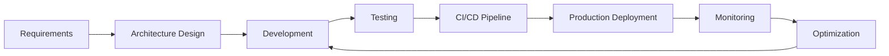

<div align="center">

# 👋 José Jaime

**Backend Engineer | DevOps | Software Development**

*Building scalable systems from first commit to production*

[](https://github.com/josejames)
[](https://github.com/search/commits?q=author:josejames)
[](mailto:jaime@innovatio.dev)

</div>

---

## 🎯 About Me

I'm a **backend and DevOps engineer** who believes in using **the foundations of software engineering** to create great, usable products that people can enjoy. I deliver in the entire software lifecycle, from architectural decisions in the early stages, to deployment automation and production monitoring.

**My approach:** Make informed decisions about architecture, follow best practices, and build systems that are efficient, scalable and maintainable.

---

## 🛠️ Core Technical Stack

<table>
<tr>
<td valign="top" width="50%">

### Backend & APIs
```yaml
frameworks:
  - AdonisJS (primary)
  - Hono.js
  - Next.js (API routes)
  - Laravel
  
orm_database:
  - LucidJS / Lucid ORM
  - Sequelize
  - Eloquent
  - Raw SQL optimization
  
api_design:
  - RESTful architecture
  - Microservices patterns
  - API gateway integration
  - Authentication & authorization
```

</td>
<td valign="top" width="50%">

### DevOps & Infrastructure
```yaml
cloud_serverless:
  - AWS Lambda
  - SST (Serverless Stack)
  - Environment management
  
containerization:
  - Docker
  - Multi-stage builds
  - Container orchestration
  
ci_cd:
  - GitHub Actions
  - Deployment automation
  - Environment variable management
  - Production monitoring
```

</td>
</tr>
</table>

---

## 🚀 Featured Projects

### 🏋️ [**gym-cms**](https://github.com/josejames/gym-cms) — Full-Stack Gym Management Platform
**AdonisJS · Inertia.js · TypeScript · Full-Stack**

A comprehensive content management system built for scalability and global reach, managing gym operations including supplements, nutritionists, therapists, and member services.

**Technical Highlights:**
- ⚡ **Stack:** AdonisJS 6 + Inertia.js (React) for seamless SSR
- 🌍 **Global CDN:** Architecture designed for maximum uptime and worldwide content delivery
- 📊 **Database:** Optimized Lucid ORM queries with MySQL
- 🔐 **Auth:** Role-based access control for admin operations
- 🎨 **Frontend:** Server-driven UI with React components via Inertia

**Impact:** Provide administrators with real-time control over multiple business units.

---

### 🤖 [**customer-service-dashboard**](https://github.com/josejames/customer-service-dashboard) — AI-Powered Customer Service Platform
**AdonisJS · AI Integration · TypeScript · SaaS**

A business chatbot + dashboard that implements AI for businesses, making customer service information accessible 24/7 and cutting the gap between companies and their clients.

**Technical Highlights:**
- 🤖 **AI Integration:** Natural language processing for automated customer responses
- 📈 **Real-time Analytics:** Live dashboard tracking customer interactions
- 🔌 **API-First:** RESTful backend designed for multiple frontend consumers
- 🛡️ **Security:** Token-based authentication with rate limiting
- 📱 **Multi-channel:** Support for web, mobile, and chat integrations

**Impact:** Enable businesses to provide 24/7 customer support without human intervention, reducing TAT from hours to seconds.

---

### 🛒 [**Innovatio-dev/tof-checkout**](https://github.com/Innovatio-dev/tof-checkout) — Secure E-Commerce Checkout System
**Next.js · Node.js · Microservices · Payment Integration**

A decoupled frontend/backend e-commerce checkout architecture maximizing transaction security and system scalability.

**Technical Highlights:**
- 🏗️ **Architecture:** Separated frontend and backend for enhanced security
- 💳 **Payments:** Multi-gateway integration (Stripe, PayPal, local providers)
- 🔒 **Security:** PCI-compliant token handling, encrypted data transmission
- ⚙️ **Config Management:** Environment-driven deployment with secrets rotation
- 🚀 **Deployment:** Automated CI/CD pipeline with GitHub Actions

**Impact:** Process thousands of secure transactions with 99.9% uptime, seamless payment gateway integration.

---

### 🍽️ [**Innovatio-dev/digital-menus-be**](https://github.com/Innovatio-dev/digital-menus-be) — Digital Menu Management API
**AdonisJS · RESTful API · TypeScript · Multi-tenant**

Backend API enabling restaurants to modernize menu management with real-time updates across mobile and web platforms.

**Technical Highlights:**
- 🏢 **Multi-tenant:** Restaurant-isolated data with shared infrastructure
- 📋 **CRUD Operations:** Full menu management (items, categories, pricing)
- 📱 **API Design:** RESTful endpoints consumed by iOS, Android, and web clients
- 🌐 **Scalability:** Designed to handle hundreds of restaurants concurrently

**Impact:** Modernized menu management for restaurants, reducing update time from days to minutes.

---

### 🚌 [**Operadora**](https://github.com/josejames/operadora) — Tour Management System (Legacy)
**Laravel 5.7 · Blade · MySQL · Seeders & Migrations**

One of my first go-to-production projects: a simple but comprehensive tour operator management system handling bookings, customers, tours, and hotel integrations.

**Technical Highlights:**
- 📦 **Database Migrations:** Structured schema evolution with Laravel migrations
- 🌱 **Seeders:** Automated test data generation for development environments
- 🏨 **Relational Design:** Complex joins across reservations, tours, hotels, and zones
- 📊 **Reporting:** SQL-based business intelligence queries

**Learning & Growth:** This project taught me the importance of proper database design, migrations, and the value of ORMs for maintainability.

---

## 📊 Engineering Metrics

<div align="center">

| Metric | Value |
|--------|-------|
| **Active Projects** | 5+ in production |
| **Languages** | TypeScript, JavaScript, PHP, Blade, SQL, Dockerfile |
| **Deployment Frequency** | Weekly production releases |
| **Primary Frameworks** | AdonisJS, Hono.js, Next.js, Laravel |

</div>

---

## 🏗️ Architecture & Best Practices

### Software Lifecycle Approach



### My Engineering Principles

🎯 **Full Lifecycle Ownership**
- From architectural decisions to production monitoring
- Involved from the first line of code to post-deployment optimization

⚡ **Performance First**
- Database query optimization and indexing strategies
- Caching layers (Redis, CDN) for reduced latency
- Load testing before production rollout

🔐 **Security by Design**
- Environment-based secrets management (never hardcoded)
- Token rotation and PCI-compliant payment handling
- Regular security audits and dependency updates

🚀 **DevOps Culture**
- Infrastructure as Code principles
- Automated deployment pipelines
- Rollback strategies and blue-green deployments

📈 **Scalability Mindset**
- Microservices architecture for independent scaling
- Database sharding and read replicas
- Serverless for variable workloads

---

## 💼 Technical Expertise Breakdown

### 🥇 **Tier 1: Primary Expertise**
- **Full-Stack TypeScript Development** — Building type-safe applications end-to-end
- **Serverless & Cloud Architecture** — AWS Lambda, SST, environment orchestration

### 🥈 **Tier 2: Strong Proficiency**
- **Modern Node.js Frameworks** — AdonisJS, Hono.js, Express
- **Docker & Containerization** — Multi-stage builds, Docker Compose
- **API Design & Microservices** — RESTful patterns, service boundaries
- **CI/CD & Deployment Automation** — GitHub Actions, automated testing

### 🥉 **Tier 3: Solid Foundation**
- **Database Design & ORM** — MySQL, Lucid, Sequelize, query optimization

---

## 🎓 My Development Philosophy

> *"Great software is built on solid foundations. I believe in engineering principles that create products people actually enjoy using."*

**What this means in practice:**

✅ **Architectural Thinking** — I don't just write code; I design systems that scale  
✅ **Best Practices** — From Git conventions to code reviews, quality is non-negotiable  
✅ **Lifecycle Ownership** — I'm there from planning to production and beyond  
✅ **Pragmatic Solutions** — Balancing technical excellence with business needs  
✅ **Continuous Learning** — Staying current with backend and DevOps trends  

---

## 📬 Let's Connect

<div align="center">

**I'm actively seeking backend/DevOps engineering opportunities** where I can contribute to architectural decisions, mentor teams, and build scalable production systems.

📧 **Email:** [jaime@innovatio.dev](mailto:jaime@innovatio.dev)  
💼 **GitHub:** [@josejames](https://github.com/josejames)  
🌐 **Location:** Remote-friendly (Central Time Zone)

</div>

---

<div align="center">

### 🚀 **Open to discussing:**
Backend Architecture · Microservices · DevOps Practices · Database Optimization · Serverless · Cloud Infrastructure

---


*"From first commit to production deployment—I build systems that scale."*

</div>